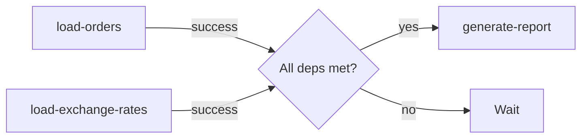

# Scheduler API

The Scheduler manages when and how pipelines run. It supports cron-based scheduling, manual triggers, webhook triggers, and dependency-based execution.

## Endpoints

### List scheduled pipelines

```
GET /api/v1/scheduler/jobs
```

**Response:**

```json
{
  "data": [
    {
      "pipeline": "user-analytics",
      "schedule": "0 */6 * * *",
      "status": "active",
      "last_run_at": "2026-02-15T06:00:00Z",
      "next_run_at": "2026-02-15T12:00:00Z",
      "timezone": "UTC"
    },
    {
      "pipeline": "daily-report",
      "schedule": "0 8 * * 1-5",
      "status": "active",
      "last_run_at": "2026-02-14T08:00:00Z",
      "next_run_at": "2026-02-17T08:00:00Z",
      "timezone": "America/New_York"
    }
  ]
}
```

### Update schedule

```
PUT /api/v1/scheduler/jobs/:pipeline
```

```json
{
  "schedule": "0 */4 * * *",
  "timezone": "America/New_York",
  "enabled": true
}
```

### Pause a schedule

```
POST /api/v1/scheduler/jobs/:pipeline/pause
```

### Resume a schedule

```
POST /api/v1/scheduler/jobs/:pipeline/resume
```

## Cron expressions

DataFlow uses standard cron expressions with an optional seconds field:

```
┌───────── minute (0-59)
│ ┌───────── hour (0-23)
│ │ ┌───────── day of month (1-31)
│ │ │ ┌───────── month (1-12)
│ │ │ │ ┌───────── day of week (0-7, 0 and 7 = Sunday)
│ │ │ │ │
* * * * *
```

### Common schedules

| Expression | Description |
|------------|-------------|
| `*/5 * * * *` | Every 5 minutes |
| `0 * * * *` | Every hour |
| `0 */6 * * *` | Every 6 hours |
| `0 2 * * *` | Daily at 2:00 AM |
| `0 8 * * 1-5` | Weekdays at 8:00 AM |
| `0 0 1 * *` | First day of every month |

## Dependency scheduling

Pipelines can be triggered by other pipeline completions:

```yaml
name: generate-report
trigger:
  type: pipeline
  depends_on:
    - name: load-orders
      status: success
    - name: load-exchange-rates
      status: success
```



## Webhook triggers

Trigger pipelines from external systems:

```yaml
name: on-demand-sync
trigger:
  type: webhook
  path: /api/trigger/on-demand-sync
  secret: ${WEBHOOK_SECRET}
```

```bash
curl -X POST \
  -H "X-Webhook-Secret: ${WEBHOOK_SECRET}" \
  https://dataflow.example.com/api/trigger/on-demand-sync
```

> [!warning] Webhook security
> Always use the `secret` field to authenticate webhook requests. Without it, anyone can trigger your pipeline.

## Concurrency control

Prevent overlapping runs:

```yaml
scheduler:
  concurrency: 1          # Max concurrent runs
  queue_overflow: skip     # skip | queue | replace
```

| Strategy | Behavior |
|----------|----------|
| `skip` | Drop the new run if one is already running |
| `queue` | Queue the new run to start after the current one |
| `replace` | Cancel the current run and start a new one |

## SDK usage

```python
# List all jobs
jobs = client.scheduler.list()

# Pause a pipeline
client.scheduler.pause("user-analytics")

# Resume
client.scheduler.resume("user-analytics")

# Update schedule
client.scheduler.update("user-analytics", schedule="0 */4 * * *")

# Trigger manually
run = client.scheduler.trigger("user-analytics")
```

## Related

- [[concepts/pipelines|Pipeline Concepts]] — pipeline scheduling configuration
- [[api-reference/pipeline|Pipeline API]] — pipeline management
- [[api-reference/events|Events API]] — subscribe to scheduler events
