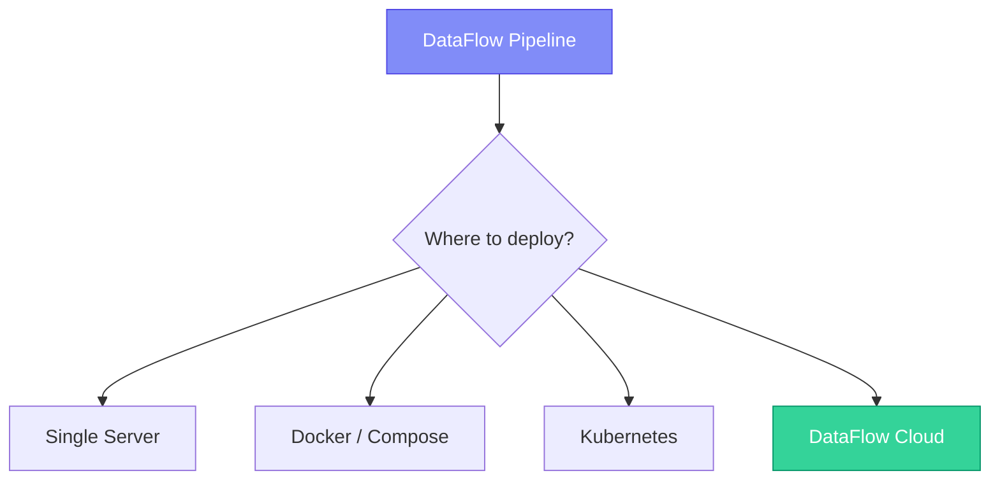

# Deployment

This guide covers deploying DataFlow pipelines to production environments — from a simple server to containerized infrastructure.

## Deployment options



## Option 1: Single server

The simplest deployment — install DataFlow on a server and run pipelines with the scheduler.

```bash
# Install on your server
pip install dataflow-cli

# Start the scheduler daemon
dataflow scheduler start --daemon
```

> [!warning] Single point of failure
> A single server deployment has no redundancy. If the server goes down, pipelines stop running. Consider Docker or Kubernetes for production workloads.

## Option 2: Docker

### Dockerfile

```dockerfile
FROM python:3.12-slim

WORKDIR /app

# Install DataFlow
RUN pip install dataflow-cli==2.4.0

# Copy pipeline definitions
COPY dataflow.yml .
COPY pipelines/ ./pipelines/
COPY transforms/ ./transforms/

# Start the scheduler
CMD ["dataflow", "scheduler", "start"]
```

### Docker Compose

```yaml
# docker-compose.yml
version: "3.8"

services:
  dataflow:
    build: .
    env_file: .env
    volumes:
      - ./pipelines:/app/pipelines
      - dataflow-state:/app/.dataflow
    restart: unless-stopped

  dataflow-api:
    build: .
    command: dataflow api start --port 8080
    ports:
      - "8080:8080"
    env_file: .env

volumes:
  dataflow-state:
```

```bash
docker-compose up -d
```

## Option 3: Kubernetes

### Deployment manifest

```yaml
# k8s/deployment.yml
apiVersion: apps/v1
kind: Deployment
metadata:
  name: dataflow-scheduler
spec:
  replicas: 1
  selector:
    matchLabels:
      app: dataflow
  template:
    metadata:
      labels:
        app: dataflow
    spec:
      containers:
        - name: dataflow
          image: dataflow/dataflow:2.4.0
          command: ["dataflow", "scheduler", "start"]
          envFrom:
            - secretRef:
                name: dataflow-secrets
          volumeMounts:
            - name: pipelines
              mountPath: /app/pipelines
      volumes:
        - name: pipelines
          configMap:
            name: dataflow-pipelines
```

> [!tip] GitOps workflow
> Store your pipeline definitions in a Git repository and use ArgoCD or Flux to automatically deploy changes. This gives you version history and rollback for free.

## CI/CD integration

### GitHub Actions

```yaml
# .github/workflows/deploy.yml
name: Deploy Pipelines

on:
  push:
    branches: [main]

jobs:
  test:
    runs-on: ubuntu-latest
    steps:
      - uses: actions/checkout@v4
      - uses: actions/setup-python@v5
        with:
          python-version: "3.12"
      - run: pip install dataflow-cli
      - run: dataflow test tests/

  deploy:
    needs: test
    runs-on: ubuntu-latest
    steps:
      - uses: actions/checkout@v4
      - run: docker build -t dataflow:${{ github.sha }} .
      - run: docker push myregistry/dataflow:${{ github.sha }}
      - run: kubectl set image deployment/dataflow dataflow=myregistry/dataflow:${{ github.sha }}
```

## Environment configuration

Use environment-specific configuration files:

```bash
# Development
dataflow run --env development

# Staging
dataflow run --env staging

# Production
dataflow run --env production
```

Each environment loads from `.env.{environment}`. See [[configuration/environment-variables|Environment Variables]] for details.

## Related

- [[guides/monitoring|Monitoring]] — monitor deployed pipelines
- [[guides/authentication|Authentication]] — secure your API in production
- [[configuration/config-file|Configuration]] — production configuration settings
